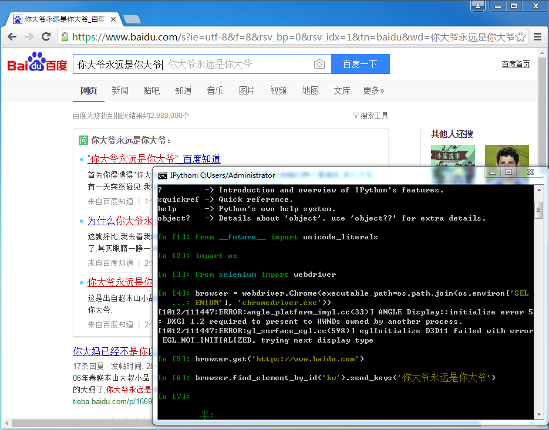
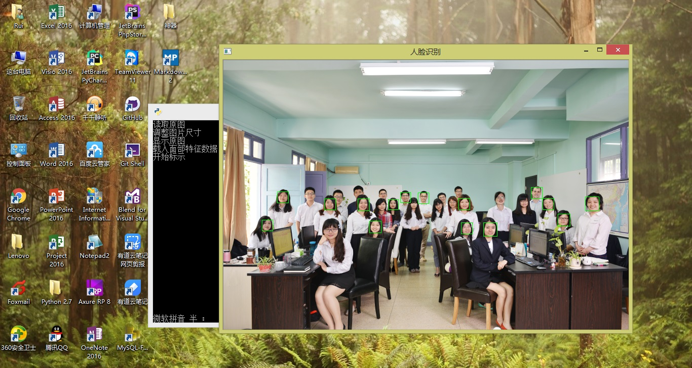
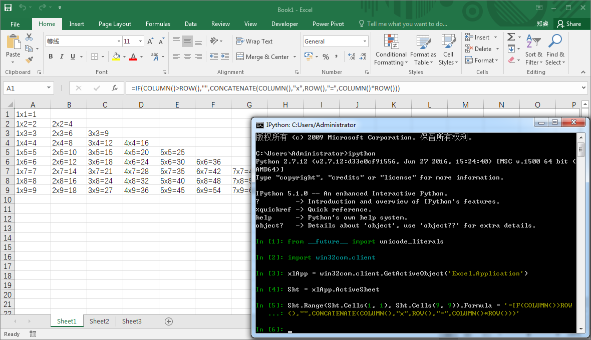
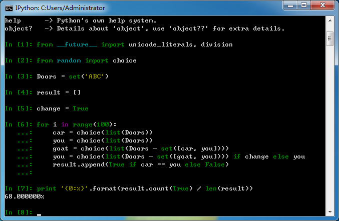
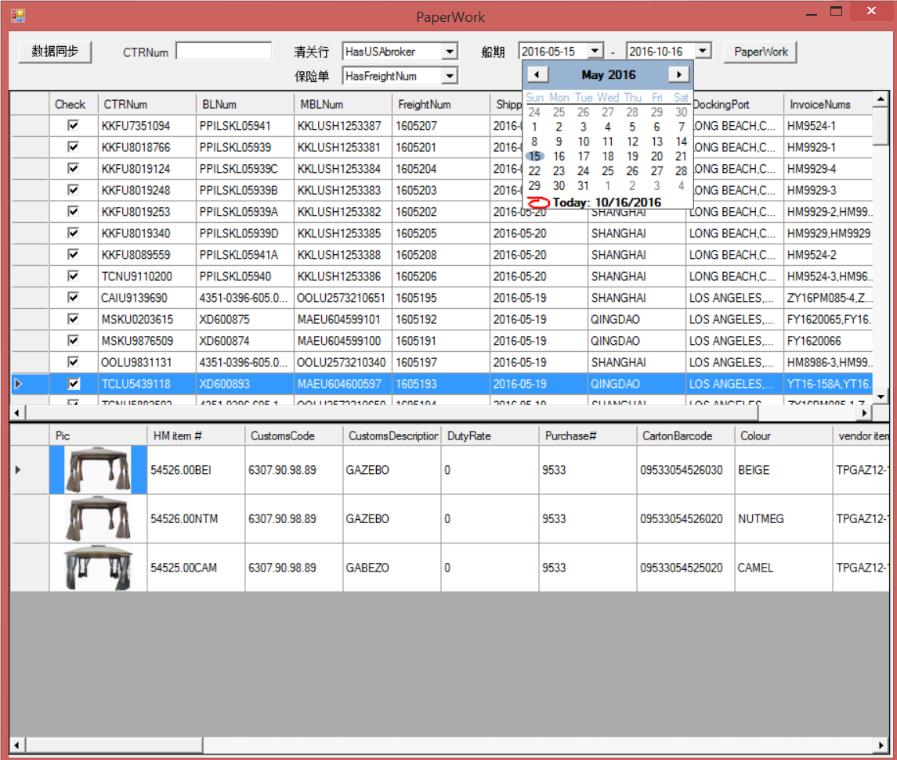
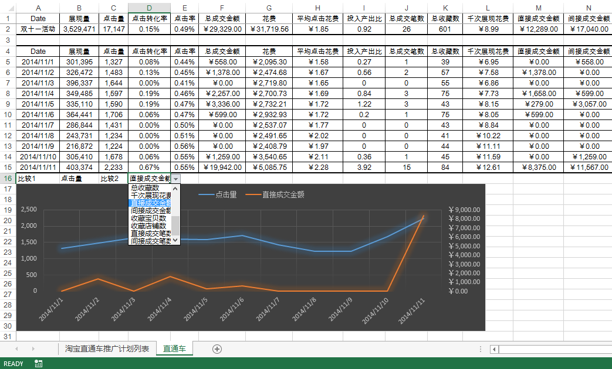
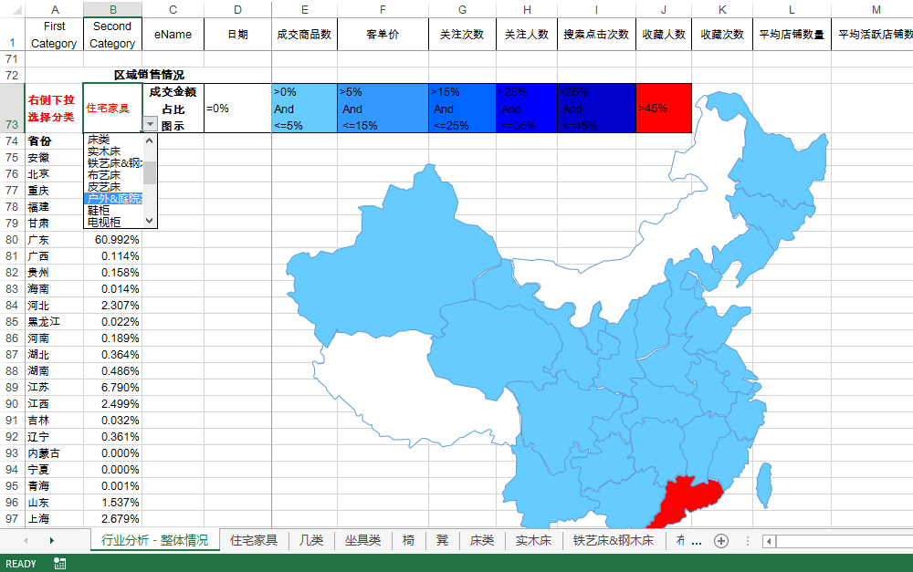
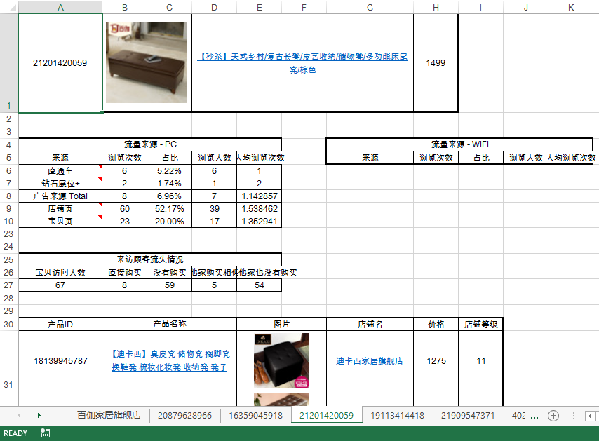

## Python ##

关于使用Python2、还是Python3，各有各的好处自己权衡就行了。可以选择多版本共存的方式进行学习。

>Windows下使用Python，一定要记住这个网站 [Unofficial Windows Binaries for Python Extension Packages](http://www.lfd.uci.edu/~gohlke/pythonlibs/) 

这里用于记录一些日常工作使用的脚本Demo。

可以用Python做哪些有趣的东西

- *Selenium自动化*

- *人脸识别*

- *Office自动化*

- *爬虫*

- *数据分析*

- *图形界面*

## Excel ##
已经使用多年了，算是Office软件骨灰级的用户。也写过不少的VBA模块插件、设计格式化分析报告。如果工作中经常需要处理数据还是很有必要掌握。

这里有不少测试代码都是Python进行Excel自动化操作的，感觉写起来比VBA更简洁高效
