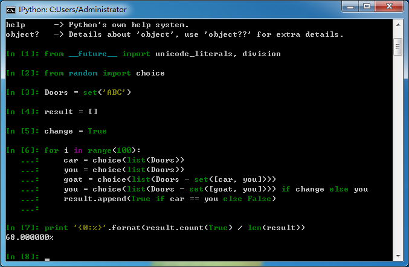

## 蒙提霍尔问题 ##
聊聊概率这件事 [蒙提霍尔问题](http://baike.baidu.com/view/68669.htm)


```python
from __future__ import unicode_literals, division
from random import choice

Doors = set('ABC')

result = []
change = False
for i in range(100):
    car = choice(list(Doors))
    you = choice(list(Doors))
    goat = choice(list(Doors - set([car, you])))
    you = choice(list(Doors - set([goat, you]))) if change else you
    result.append(True if car == you else False)

print '{0:%}'.format(result.count(True) / len(result))
```
*不更改*


*更改*



*看来综艺节目全是套路*

